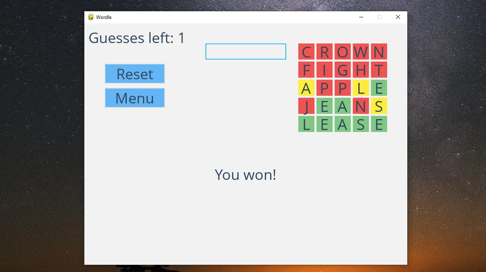

# Wordle
A simple Wordle clone implemented in Python, offering both a command-line interface and a graphical interface using Pygame. Players guess secret words with color-coded feedback (green for correct, yellow for present, red for absent letters), similar to the popular Wordle game.



## Features

- **Multiple Word Sizes**: Play with 5, 6, 7, or 8-letter words. The game randomly selects a secret word of the chosen length from the included word lists.
- **Limited Guesses**: You have a limited number of attempts to guess the word (equal to word length + 1 tries; e.g. 6 tries for a 5-letter word).
- **Color-Coded Feedback**: After each guess, letters are highlighted with a color indicating the guess accuracy (green for exact matches, yellow for correct letters in the wrong position, and red for letters not in the word). This feedback system helps you narrow down the correct answer.
- **Two Game Modes**: Play in the terminal or enjoy a full GUI built with Pygame. The CLI mode prints colored text feedback in the console, while the GUI mode provides an interactive window with graphics and mouse/keyboard controls.
- **Dictionary Validation**: Guesses are validated against an English dictionary via an online API (dictionaryapi.dev) to ensure they are real words. The game caches validated words to avoid repeated API calls and can gracefully continue offline if the API is unavailable.
- **Interactive GUI Features**: The GUI includes a main menu to choose word length, on-screen display of your guesses with colored boxes, and buttons to reset the game or return to the main menu.

## Installation

1. **Clone the repository**: Download the source code using `git clone` or as a ZIP archive.
2. **Install Python 3**: Make sure you have Python 3 installed on your system.
3. **Install dependencies**: Install the required libraries using pip:
```
pip install pygame requests
```
*Pygame* is used for the GUI, and *Requests* is used for dictionary API calls.

## Usage

### Command-Line Interface

To play in the terminal, run the `wordle.py` script using Python:
```
python wordle.py
```
On start, the game will prompt: “Enter desired word size (5-8) to start:”. Enter a number between 5 and 8 to select the word length. The game then randomly chooses a secret word of that length and begins the guessing loop.

Type your guess when prompted (the input must be exactly the chosen word length). After each guess, the program provides feedback by printing each letter with a colored background in the console. A letter will appear green if it’s in the correct position, yellow if the letter is in the word but a different position, and red if the letter is not in the word. This color-coding updates you on your progress in finding the secret word.

You have a limited number of guesses to find the correct word. If you guess the word correctly within the allowed tries, the game will congratulate you; otherwise, it will reveal the secret word after your last attempt. You can then start a new game by running the script again.

### Graphical User Interface

To play with the Pygame-based GUI, run the `runner.py` script:
```
python runner.py
```
A window will open with the Wordle game interface. In the main menu, click a button to select the desired word length (5, 6, 7, or 8 letters). The game will then start with a blank grid. In the game screen:
- **Entering Guesses**: Click on the input box at the top of the window (it’s selected by default), and type your guess using the keyboard. The input box will only allow the appropriate number of letters. Press Enter to submit your guess. You can use Backspace to correct any letter before pressing Enter.
- **Feedback Display**: After submitting a guess, the guess will appear on the screen with each letter in a colored square. Just like the CLI (and the original Wordle), green boxes indicate letters in the correct position, yellow boxes indicate letters that appear in the word but in a different position, and red boxes indicate letters not in the word. The GUI updates the grid with each guess and also shows the number of guesses remaining.
- **Reset or Quit**: You can start over or change mode at any time. Click the “Reset” button to restart the game with a new random word of the same length, keeping the current session. Click “Menu” to return to the main menu (from there you can choose a different word length or exit the game). To quit completely, you can close the window or click the “Quit” option in the main menu.

Example: If the secret word is "APPLE" and you guess "ALERT", the first letter "A" will show in green (correct letter and position), "L" in yellow (the letter “L” is in the word but at a different position), and the other letters in red (not in the word). This visual feedback helps you deduce the correct word within the given attempts.

## Project Structure

The repository is organized as follows:
- **`wordle.py`**: Main Python script for the CLI version of the game. It contains the `WordleGame` class which implements the game logic (word selection, validating guesses, checking letters, and console output). Running this script launches the terminal game loop (it prompts for word length and then for guesses).
- **`runner.py`**: Main Python script for the GUI version. It defines the `WordlePygame` class which manages the game window, event handling, and rendering of graphics. Running this script opens the graphical game window (starting at the main menu).
- **Word list files (`5.txt`, `6.txt`, `7.txt`, `8.txt`)**: Text files containing a list of English words for each supported word length. These files serve as the game’s dictionary from which a random secret word is chosen for each new game. By default, the program loads the first 1000 words from the file corresponding to the chosen length. You can add or remove words in these files to change the pool of possible secret words.

## Configuration

You can customize the game behavior and appearance by editing a few parts of the code or assets:
- **Word Lists**: To modify the pool of solution words, edit the `5.txt`/`6.txt`/`7.txt`/`8.txt` files. You can update these lists with your own words or even replace them entirely. The game currently loads a fixed number of words (1000) from each file for performance. If you add fewer or more words, adjust the `LISTSIZE` constant in `WordList` (in `wordle.py`) accordingly.
- **GUI Appearance**: The colors and fonts used in the GUI can be adjusted. For example, the color values for correct/close/wrong letters, button colors, etc., are defined at the top of `runner.py`. You can change these constants to alter the look and feel (e.g., use a different color scheme). If you wish to use a different font, you can replace the TTF file in `assets/fonts/` and update the `OPEN_SANS` path in `runner.py` accordingly.
- **Gameplay Rules**: By default, the number of guesses is set to word length + 1, and word validation uses the dictionary API. These rules can be changed in `WordleGame` (`wordle.py`) if you want to experiment (for example, disabling validation or changing the number of allowed attempts).

## Acknowledgments

This project was inspired by the original Wordle game created by Josh Wardle. It was developed as a fun exercise in Python game development. Special thanks to the maintainers of the Pygame library and the free Dictionary API (dictionaryapi.dev) for enabling word validation in the game.
